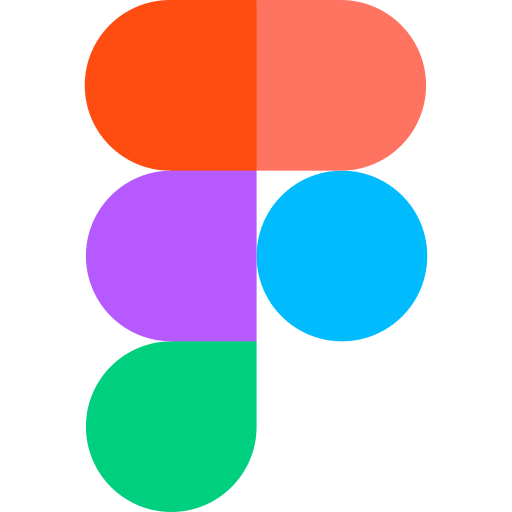
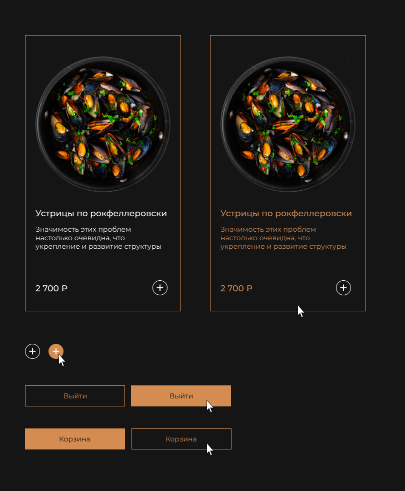
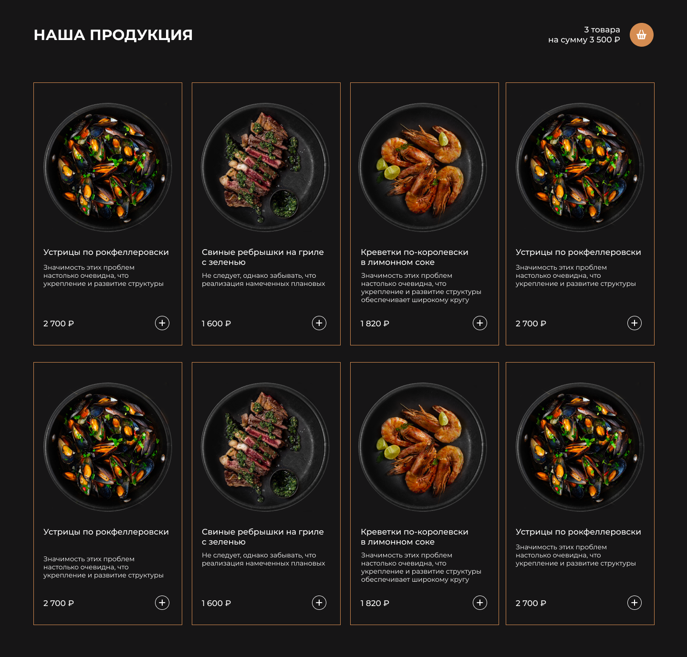
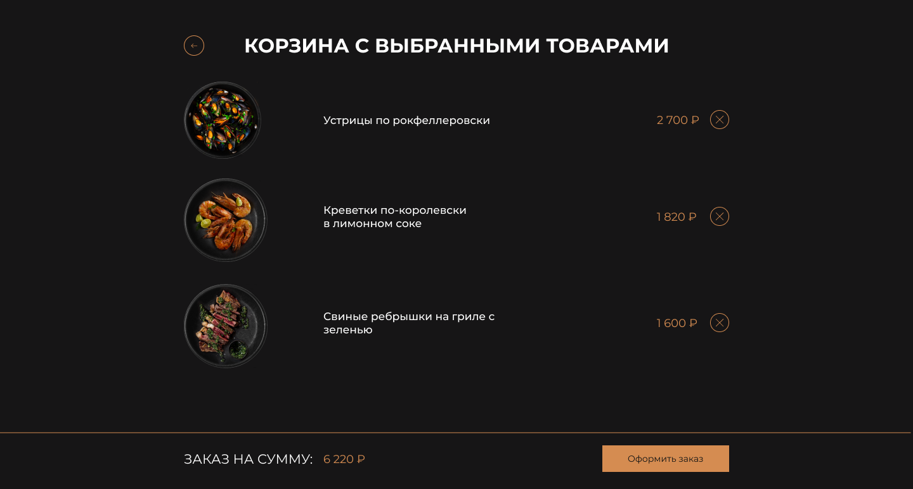

<h1 style="display: inline;">
   FIGMA
</h1>






<h1 style="display: inline;">
   VUEX
</h1>

Vuex — это библиотека для управления состоянием в приложениях, созданных на Vue.js. Она представляет собой централизованное хранилище данных для всех компонентов приложения с правилами, гарантирующими, что состояние может изменяться только предсказуемым образом.

## Основные концепции Vuex
1. Хранилище (Store): Это объект, который содержит состояние вашего приложения. В Vuex хранилище является единственным источником данных, и его можно рассматривать как "единый источник правды" для вашего приложения.
2. Состояние (State): Это объект, который содержит данные приложения. Оно может быть доступно из любого компонента.
3. Геттеры (Getters): Это вычисляемые свойства, которые позволяют извлечь и вычислить данные из состояния. Они аналогичны вычисляемым свойствам Vue.
4. Мутации (Mutations): Это единственный способ изменить состояние в Vuex. Каждая мутация имеет обработчик, который принимает состояние и полезную нагрузку (payload) в качестве аргументов.
5. Действия (Actions): Это функции, которые могут выполнять асинхронные операции и вызывать мутации. Они используются для обработки операций, таких как запросы к API.
6. Модули (Modules): Позволяют разбивать хранилище на отдельные модули с их собственным состоянием, геттерами, мутациями и действиями.


## Создание хранилища (store\index.js)
```
import { createStore } from 'vuex'

// Функция для сохранения состояния в localStorage
const saveState = (state) => {
  try {
    const serializedState = JSON.stringify(state)
    localStorage.setItem('vuex-state', serializedState)
  } catch (err) {}
}

export default createStore({
  state: {
    countProductsInBasket: 0,
    allPriceProductsInBasket: 0,
    products: [
      { id: 0, img: '1.png', title: 'Устрицы по рокфеллеровски', subtitle: 'Значимость этих проблем настолько очевидна, что укрепление и развитие структуры', price: 2700 },
      { id: 1, img: '2.png', title: 'Свиные ребрышки на гриле с зеленью', subtitle: 'Не следует, однако забывать, что реализация намеченных плановых', price: 1600 },
      { id: 2, img: '4.png', title: 'Креветки по-королевски в лимонном соке', subtitle: 'Значимость этих проблем настолько очевидна, что укрепление и развитие структуры обеспечивает широкому кругу', price: 1820 },
      { id: 3, img: '5.png', title: 'Устрицы по рокфеллеровски', subtitle: 'Значимость этих проблем настолько очевидна, что укрепление и развитие структуры', price: 2700 }
    ],
    basketProducts: []
  },
  getters: {
    getCountProductsInBasket: state => state.countProductsInBasket,
    getAllPriceProductsInBasket: state => state.allPriceProductsInBasket,
    getProducts: state => state.products,
    getBasketProducts: state => state.basketProducts
  },
  mutations: {
    incrementProductCount (state) {
      state.countProductsInBasket++
      saveState(state)
    },
    addProductToBasket (state, product) {
      state.basketProducts.push(product)
      state.countProductsInBasket++
      state.allPriceProductsInBasket += product.price
      saveState(state)
    },
    removeProductFromBasket (state, productId) {
      const productIndex = state.basketProducts.findIndex(product => product.id === productId)
      if (productIndex !== -1) {
        const product = state.basketProducts[productIndex]
        state.basketProducts.splice(productIndex, 1)
        state.countProductsInBasket--
        state.allPriceProductsInBasket -= product.price
        saveState(state)
      }
    }
  },
  actions: {
    addProductToBasket ({ commit }, product) {
      commit('addProductToBasket', product)
    },
    removeProductFromBasket ({ commit }, productId) {
      commit('removeProductFromBasket', productId)
    }
  },
  modules: {}
})
```

## Использование состояния и действий в компоненте CardProduct.vue
```
<script>
import { mapActions } from 'vuex'

import AddIcon from '../icons/AddIcon.vue'
import DeleteIcon from '../icons/DeleteIcon.vue'

export default {
  name: 'CardProduct',
  components: {
    AddIcon,
    DeleteIcon
  },
  props: {
    id: Number,
    productId: Number,
    customClass: String,
    customStyle: Object,
    customImgStyle: Object,
    imageSrc: String,
    title: String,
    subtitle: String,
    isActiveSubtitle: Boolean,
    customTitleStyle: Object,
    customCountBtStyle: Object,
    price: Number,
    isActiveAdd: Boolean,
    isActiveDel: Boolean
  },
  methods: {
    ...mapActions(['addProductToBasket', 'removeProductFromBasket']),
    addToBasket () {
      const product = {
        id: this.id,
        img: this.imageSrc,
        title: this.title,
        price: this.price
      }
      this.addProductToBasket(product)
    },
    removeFromBasket () {
      this.$emit('remove-product', this.productId)
    }
  }
}
</script>
```
